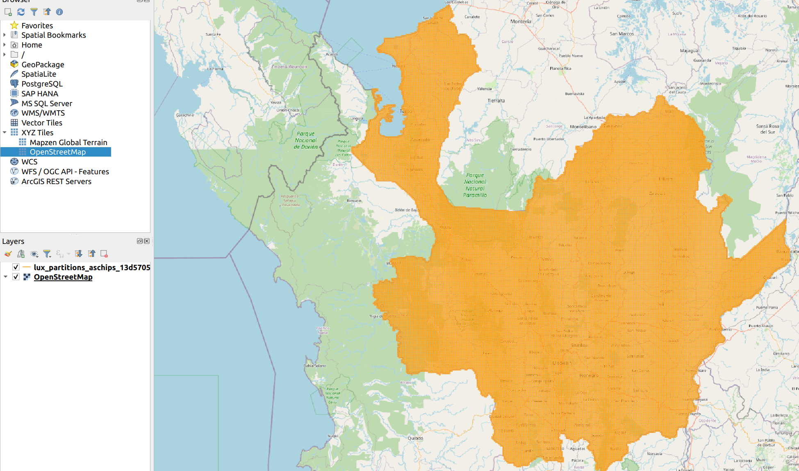
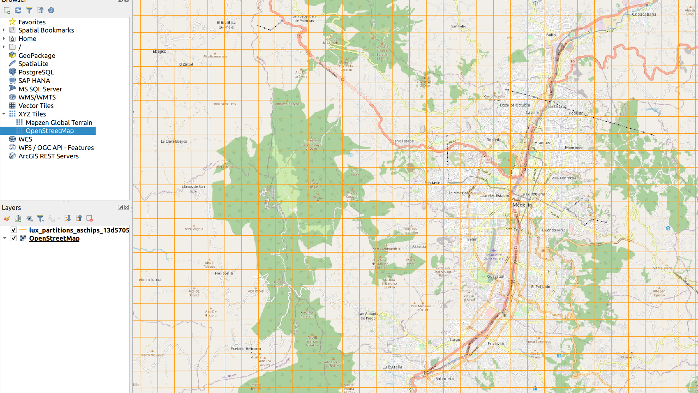
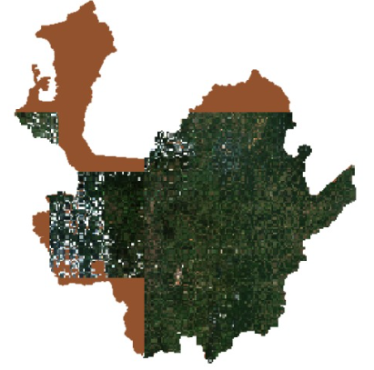
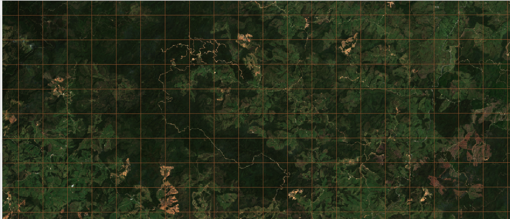

# THE HEAVY LIFTER: COMPLEX DATA EXTRACTION PROCESS DETAILED

---

# Table of Contents

- [TOOL INTRODUCTION](#tool-introduction)
- [OUR DATASETS](#our-datasets)
  - [Sentinel-2 MSI: MultiSpectral Instrument, Level-2A](#sentinel-2-msi-multispectral-instrument-level-2a)
    - [Bands of interest for Sentinel-2 (Our X; the Input features)](#bands-of-interest-for-sentinel-2-our-x-the-input-features)
  - [MOD44B.006 Terra Vegetation](#mod44006-terra-vegetation)
    - [Bands of interest from MODIS TERRA (Our y; the output prediction)](#bands-of-interest-from-modis-terra-our-y-the-output-prediction)
- [ADJUSTING THE DATA TO OUR GOAL](#adjusting-the-data-to-our-goal)
  - [GEETILES. From Google Earth Engine datasets to tiles as geotiff arrays](#geetiles-from-google-earth-engine-datasets-to-tiles-as-geotiff-arrays)
  - [Using `GEETILES`](#using-geetiles)
    - [Defining the geometry of our area of interest](#defining-the-geometry-of-our-area-of-interest)
    - [The GEOJSON and the Coordinated Reference Systems `(SRC)`](#the-geojson-and-the-coordinated-reference-systems-src)
    - [Defining our Dataset Objectually!](#defining-our-dataset-objectually)
    - [Calling the utility from the terminal to create the grid](#calling-the-utility-from-the-terminal-to-create-the-grid)
    - [Downloading the Data](#downloading-the-data)
    - [Visualizing the downloaded data](#visualizing-the-downloaded-data)
    - [What to do next!](#what-to-do-next)


<br>

## TOOL INTRODUCTION

This notebook aims to detail the process of extracting and doing an inicial preprocessing of the Satellital Imagery used in this project.

Due to the dimensions of this data we strongly recommend, *if you are not trying to use the tool to download any other data region*, **that you download the already trimmed down and compressed [tensors available publicly on this drive](https://drive.google.com/drive/folders/1ZrSY2Q5euIfnwB8RI4-LcLyLbHGZbWx-?usp=sharing)**.

This optimized version reduces the data volume from `~30Gigabytes` to approximately `1.98Gigabyes`. But also due to the **Earth Engine Imposed data rates constrains**, the download is capped even though its parallelized and done in batchs.

We aim for both this `.MD`  to be seen as a showcase of the data extraction challenges and how they are overcomed using the provided tools.

This first documentation file contains very few codelines, but rather lists the applicable commands and mentions details about their implementations on the project as a whole.

<br>
<br>

---

## OUR DATASETS

### Sentinel-2 MSI: MultiSpectral Instrument, Level-2A

This dataset contains multiple electromagnetic readings taken from the MultiSpectral instrument within the Sentinel-2 satellite. 

The images served by this dataset are of high resolution, raster based multi-band representations. This resolution varies by the wavelenght spectrum analyzed within each band of the instrument.

For example,the satellite's image color channels (R,G,B) are taken with a resolution of 10 meters, while the atmosphere aerosols have a resolution of 60 meters.

This is important because each pixel on the images maps directly to a metric representation. Thus, each visible pixel (with its respective combination of the Red, Green and Blue channels) maps directly to a 10 meter area within the requested ROI (region of interest)

Below you can find a table containing the information related to the bands used for this model. For a full reference, please refer to the [official band table](https://developers.google.com/earth-engine/datasets/catalog/COPERNICUS_S2_SR#bands)

#### Bands of interest for Sentinel-2 (Our X; the Input features)

| Name | Units | Min | Max | Scale | Pixel Size | Wavelength | Description |
| ---- | ----- | --- | --- | ----- | ---------- | ---------- | ----------- |
| ...   |   ...    | ... |... |... | ... | ... | ... |
| B2   |       | 0.0001 | | | 10 meters | 496.6nm (S2A) / 492.1nm (S2B) | Blue |
| B3   |       | 0.0001 | | | 10 meters | 560nm (S2A) / 559nm (S2B) | Green |
| B4   |       | 0.0001 | | | 10 meters | 664.5nm (S2A) / 665nm (S2B) | Red |
| QA60   |       | 0.0001 | | | 60 meters | 664.5nm (S2A) / 665nm (S2B) | Cloud mask |

### MOD44B.006 Terra Vegetation

This data, which is provided by the NASA, contains rasters with information related to the land vegetation's coverage.

Out of all the bands available, we are specifically interested in these bands, as follows:

#### Bands of interest from MODIS TERRA (Our y; the output prediction)

| Name                   | Units | Min | Max | Scale | Description                                   |
| ---------------------- | ----- | --- | --- | ----- | --------------------------------------------- |
| Percent_Tree_Cover     | %     | 0   | 100 |       | Percent of a pixel which is covered by tree canopy |
| Percent_NonTree_Vegetation | %     | 0   | 100 |       | Percent of a pixel which is covered by non-tree vegetation |

Of course, the full definition can be accessed from [the official band table](https://developers.google.com/earth-engine/datasets/catalog/MODIS_006_MOD44B#bands)

---

## ADJUSTING THE DATA TO OUR GOAL

Since our goal is to **create a model capable of predicting a % of vegetation coverage from a satellital image**, our choices regarding the handling of the data are extremely important.

Thus, we select our tools based on the principal problems that will arise for this goal to be achievable.

Specifically, we identified the following challenges:

1. Our ROI is very big, and each pixel represents only 10meters. How can we divide and conquer?
2. Our X and y come from two different datasets. How can we align the geotagged coordinates from the two datasets?

The solution to these problems comes from the library `geetiles`

### GEETILES. From Google Earth Engine datasets to tiles as geotiff arrays

`GEETILES` is a tool based on the **Google Earth ToolKit**, but modified to streamline the process of tiling a Region Of Interest.

We call **`"Tiling"`** the process of dividing our **`ROI`** into **squared** areas of consistent size.

The tool abstracts the challenge of regularizing the pixels, creating the tiling, parallelizing  the download of the images and aligning the coordinates within the files to match the grid of tiles.

In order to do this, we must first install the required dependencies:

```bash
pip install git+https://github.com/Felipe-RA/geetiles
```

This is a `pip` styled package hosted on github. Specifically, a fork of the original tool (with some compatibility modifications) from the original developer [rramosp](https://github.com/rramosp/geetiles)

<br>

---

<br>

### Using `GEETILES`


#### - Defining the geometry of our area of interest

In order to use `geetiles` we need to obtain a **geometry file** that defines our **`ROI`**. In our case, the **`Department of Antioquia`**.

This Geometry file defines an `irregular_poligon` which encircles the specified **`ROI`**.  

The file extension **MUST** be a `.wkt` file. They are usually available from government sites related to tax collection and population polling, or from faculties of political sciences/geology.

We found that these files are usually enclosed on a bigger format called `.SHAPE`. These files link geolocation data with political data to define borders and are accessed as dataframes.

In our case, we found this under the [**DANE Government Organization**](https://geoportal.dane.gov.co/servicios/descarga-y-metadatos/datos-geoestadisticos/) specifically for  **Colombia**.

<br>

---

#### - The GEOJSON and the Coordinated Reference Systems `(SRC)`

Once we have our `.wkt` we can create a special `GEOJSON` which will create the tiled grid for our `ROI`

You could think of a  `GEOJSON` as a  special kind of `json` which also contains geolocational information specified as coordinate under a specific `Coordinated Reference System "SRC"`

A common system is `EPSG:4326"`, its important that both the `GEOJSON` and the images (which we will soon see that are represented as `rasters` of `.tif` format)

<br>

---

#### - Defining our Dataset  Objectually!

The `geetiles` tool requires a **Data Definition** expressed as a **Python** `class`.

For our specific project, these must live under the directory called [defs/](defs/)

The specific links to our DataClasses are as follows:

1. For our  [Sentinel2 Dataset](defs/sentinel2rgbmedian2020.py):

```python
import ee
from skimage import exposure

class DatasetDefinition:

    def __init__(self, dataset_name):
        self.dataset_name = dataset_name

    def get_dataset_name(self):
        return str("sentinel2rgbmedian2020.py")
    
    def get_gee_image(self, **kwargs):
    
        def maskS2clouds(image):
            qa = image.select('QA60')

            # Bits 10 and 11 are clouds and cirrus, respectively.
            cloudBitMask = 1 << 10
            cirrusBitMask = 1 << 11

            # Both flags should be set to zero, indicating clear conditions.
            mask = qa.bitwiseAnd(cloudBitMask).eq(0).And(qa.bitwiseAnd(cirrusBitMask).eq(0))

            return image.updateMask(mask).divide(10000)

        gee_image = ee.ImageCollection('COPERNICUS/S2_SR_HARMONIZED')\
                        .filterDate('2020-01-01', '2020-12-31')\
                        .filter(ee.Filter.lt('CLOUDY_PIXEL_PERCENTAGE',20))\
                        .map(maskS2clouds)\
                        .select('B4', 'B3', 'B2')\
                        .median()\
                        .visualize(min=0, max=0.3)
        
        return gee_image
    
    def get_dtype(self):
        return 'uint8'
```

This `class`, which must be named `DatasetDefinition`, defines the specific bands, dataset name and other utilities necessary to define the Dataset definition. It also let us do our **first preprocessing steps**

Lets take a closer look at the function `get_gee_image()`:

```python
def get_gee_image(self, **kwargs):
    
        def maskS2clouds(image):
            qa = image.select('QA60')

            # Bits 10 and 11 are clouds and cirrus, respectively.
            cloudBitMask = 1 << 10
            cirrusBitMask = 1 << 11

            # Both flags should be set to zero, indicating clear conditions.
            mask = qa.bitwiseAnd(cloudBitMask).eq(0).And(qa.bitwiseAnd(cirrusBitMask).eq(0))

            return image.updateMask(mask).divide(10000)

        gee_image = ee.ImageCollection('COPERNICUS/S2_SR_HARMONIZED')\
                        .filterDate('2020-01-01', '2020-12-31')\
                        .filter(ee.Filter.lt('CLOUDY_PIXEL_PERCENTAGE',20))\
                        .map(maskS2clouds)\
                        .select('B4', 'B3', 'B2')\
                        .median()\
                        .visualize(min=0, max=0.3)
        
        return gee_image
```

As we can see, we defined a `maskS2clouds` function, this image lets us clean the data to get clear sky conditions. These are important since clouds and pollution usually obscure specific wavelenghts and complicate the reading of some bands (specially those on the **visible spectrum**, like the colors `red`, `green` and `blue`)

Then, on our variable `gee_image` we can define it as an ImageCollection, this allows us to apply filters to define our dataset, filter by date, filter by `CLOUD PERCENTAGE`, **select the desired channels** and apply other transformations.

The transformations applied are:

- We select only the channels `['B4', 'B3', 'B2']`, which correspond to the visible spectrum of colors. 
- We call the `median` to obtain, per tile, a **single image with the median of the pixels for that specific tile**. This aims to stabilize the dataset, and also allows us to reduce the **dimentionality of the dataset by a factor of 365**, since instead of having `365` images per tile, we will only have `1`.
- We call `visualize`, which help us get a viewable format for the `.tif` images. (Which are originally rasters.)

<br>

2. For our [MODIS TERRA Dataset](defs/treecover2020.py): (defined as treecover2020.py)

```python
import ee
from geetiles import utils

class DatasetDefinition:

    def __init__(self, dataset_def):
        self.dataset_def = dataset_def

    def get_dataset_name(self):
        return str("treecover2020.py")


    def get_gee_image(self, **kwargs):
        gee_image = ee.ImageCollection('MODIS/006/MOD44B')\
                    .filterDate('2020-01-01', '2020-12-31')\
                    .select('Percent_Tree_Cover', 'Percent_NonTree_Vegetation')\
                    .median()\
                    .visualize(min=0, max=100)        
        
        return gee_image
                     
    def get_dtype(self):
        return 'uint8'
```

This `class` allows us to get the images from `MODIS_TERRA` with the following specs:

- Two bands for `'Percent_Tree_Cover', 'Percent_NonTree_Vegetation'`, which are self explanatory.
- A median, to get the `median per pixel` for the whole year.
- A `visualize`, which generates a visual representation for something that does not have an equivalent on the visible spectrum (it maps percentages from 0 to 100 to the three visible colors. Effectively creating a 3-element array with `[red,green,blue]` for each pixel, thus creating a `visualization` for the percentages).

<br>

---

#### Calling the utility from the terminal to create the grid

Once we have the `prerequisites`, we can call the file like this:

```bash
geet grid --aoi_wkt_file data/antioquia.wkt  --chip_size_meters 1000 --aoi_name antioquia --dest_dir .
```

We can modify the size of our tiles with the flag `--chip_size_meters`, we used 1000, which is 1 Km, so our tiles would cover 1Km^2.

This will generate, (it takes some time...) the `GeoJSON` that defines the grid over our `ROI`.

Superposed over a paper map, it looks like this (we are using the `QGis` tool):



<br>

This is a precise partition of the **Antioquia Department of Colombia** with exactly **`64106`** raster images of 1KM*1KM of area. 

**FUTURE PROBLEM** !!! Since we are superposing squares on a **irregular polygon** the border tiles are 'outside' of the `ROI`. This will require additional preprocessing, but this shall be done later, while downloading the images.

<br>

If we zoom out a little bit more, we can see  individual tile superposed over the beautiful city of medellin!



<br>

---

#### Downloading the Data

Now, we can download the data. The process is straightforward, you only need:

- A Google account

Run this command:

```bash
geet download --tiles_file your_grid_partition_aschips.geojson --dataset_def defs/CHOOSE_DEF_FILE.py --pixels_lonlat [100,100] --skip_if_exists
```

You must modify the `--tiles_file` with a path to the `geojson` with the grid generated in our [create the grid step](#calling-the-utility-from-the-terminal-to-create-the-grid) and the `dataset_def` with the path to the `class` that we created [in the objectual definition of our Dataset](#defining-our-dataset-objectually).

Additionally, in this step you can define the size of the images generated, which is defined by `--pixels_lonlat` and by default generates images of [100,100] pixels.

**WARNING:** The download process is time consuming due to the limitations impossed by the Earth Engine. It depends on the size of the `ROI` and the size of the land covered by each image (the bigger the images, the slower the download since its done in batches and works best when done parallelized).

#### Visualizing the downloaded data

We use the `ggdalbuidvrt` utility to create a `virtual raster` of the data. This is a like a virtual **super image** that combines all of the tiles donwloaded into a single layer that is visualizable using GeoSpacial Software like **QGIs**

The command used to create this `.vrt` is as follows:

```bash
gdalbuildvrt your_output.vrt /path/to/your/tiff/folder/*.tif
```

On this command, you only need to change the name of the file (which is `your_output.vrt` by default) and the path to the folder on which all of the data was downloaded. THanks to the magic of `bash` we can pick all of the `.tif` images, no matter their name.

This is the end result of the data download process:



This result is a zoomed-out screenshot from the QGis software that show the grid superposed with each individual tile generated.

If we zoom-in, we can clearly see the divisions done, and how they fit like a puzzle:



We can clearly see each division, and that the **images are correctly ordered** since things like dirt paths, geological landmarks and town formations show continuity from one image to the other.

Our usage of the tool was a success!

<br>

---

#### What to do next!

The next step is to follow the [Implementation of the learning Cycles](README.MD#new-the-antioquia-training-cycles)

This will allow you to know how the data is going to be compressed and serialized into a more manageable dataset that can be loaded to our conceived models!