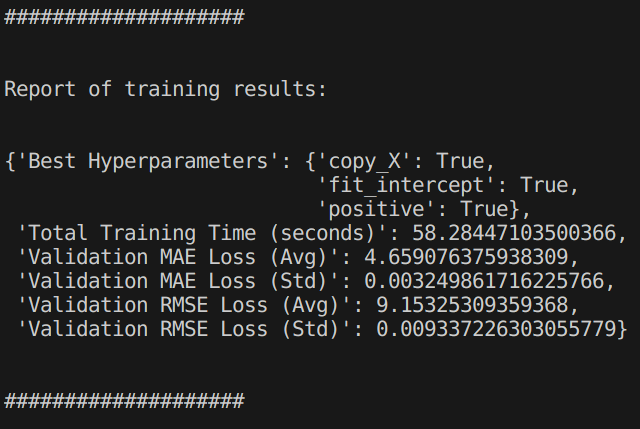

<p align="center">
  
</p>


<br>
<br>

---

<br>
<br>

# Análisis y predicción de cobertura vegetal en Antioquia con Imágenes satelitales de Sentinel-2

## Table of Contents

- [Introduction](#introduction)
- [Motivation](#motivation)
- [Installation](#installation)
  - [System Requirements](#system-requirements)
  - [Dependencies](#dependencies)
- [Data Collection](#data-collection)
  - [Security Considerations](#security-considerations)
  - [Generate Grid](#generate-grid)
  - [Download Data](#download-data)
- [**[UPDATED!]** Machine Learning Models](#machine-learning-models)
  - [Drivers and Toolkits](#drivers-and-toolkits)
  - [Installation of ML Dependencies](#installation-of-ml-dependencies)
  - [Architecture](#architecture)
  - [**[UPDATED]** Implementation of the training cycles](#new-the-antioquia-training-cycles)
    - [1. Clone this repo](#1-clone-this-repo-you-must-have-git-installed-in-your-computer)
    - [2. Install requirements if necessary](#2-remember-to-install-the-requirements-if-you-havent-done-so-already)
    - [3. Move to root folder](#3-move-to-the-root-folder-where-your-local-clon-of-this-repo-is-located)
    - [4. Get the data ready](#4-recommended-use-our-already-compressed-and-serialized-dataset)
    - [5. Run the training cycles available](#5-run-the-scripts-that-create-the-models-from-the-root-of-the-repo-clone)
- [Training Cycles and DataLoader Pipelines](#synthethic-training-cycles-to-test-gpu-and-cpu)
  - [Available Tests](#available-tests)
  - [Performance Considerations](#performance-considerations)
- [UNDER CONSTRUCTION](#under-construction)


<br>
<br>

## Introduction

  This project aims to generate predictions of the percentage of vegetation cover in Antioquia based on the Sentinel-2 and MOD44B.006 Terra Vegetation datasets. The architecture is designed to accept any number of bands (`num_bands`), but defaults to three bands corresponding to the RGB channels (B4, B3, B2) of Sentinel-2. The Sentinel-2 bands serve as the input to our model, while the target variable (total vegetation cover) is obtained by summing the `Percent_Tree_Cover` and `Percent_NonTree_Vegetation` bands to get `Percent_VegetationCover`.

  **WE STRONGLY SUGGEST THAT YOU READ THESE NOTEBOOKS:**

  - [00_data_extraction_process.MD](/00_data_extraction_process.MD)
  - [01_data_exploration.ipynb](/01_data_exploration.ipynb) 
  - [02_training_process.ipynb](/02_training_process.ipynb)
  - [03_model_application_to_new_data.ipynb](/03_model_application_to_new_data.ipynb)

<br>
<br>


## Motivation

  The motivation behind this project is to provide government and environmental organizations with tools to predict vegetation coverage based on satellite images. This allows for better environmental monitoring and decision-making.

<br>
<br>


## Installation

### System Requirements

- Officially tested on Ubuntu 22.04 LTS.
- Other operating systems and distributions may work but are not officially supported.
- Windows, as of October 2023, does not have the necessary dependencies to train the models on AMD GPUs.

### Dependencies

To run the project, you'll need:

- Python 3.x
- pip
- A modified version of the `geetiles` tool, which can be installed using the following command:

```bash
pip install git+https://github.com/Felipe-RA/geetiles
```

<br>
<br>

## Data Collection

### Security Considerations

  **BEWARE! BEFORE RUNNING THE DOWNLOAD COMMAND:**

  We use a Notebook Authenticator for the project. Google will likely issue a warning advising you not to run the code unless you are using a notebook and understand the code being executed. The code responsible for these operations is located in the `defs` directory. This code defines the instruments (ImageCollection) and bands to be used, among other post-processing steps. While our `defs` files do not access your private data, malicious applications could misuse token access to compromise your information. **Make sure to read and understand the code before executing any commands.**

<br>

### Generate Grid

<br>

  Use the `geet` tool to generate a grid over your Area of Interest (AOI) with the following command:

  ```bash
  geet grid --aoi_wkt_file data/antioquia.wkt  --chip_size_meters 1000 --aoi_name antioquia --dest_dir .
  ```

  - `--aoi_wkt_file`: Path to the `.wkt` file defining your AOI.
  - `--chip_size_meters`: Size in meters of each chip.
  - `--aoi_name`: Name for the `.geojson` file to be created.
  - `--dest_dir`: Directory where the `.geojson` file will be saved.

<br>

### Download Data

<br>

**Important**: You need a Google Earth Engine account and a cloud project to use the Earth Engine data pipeline.

1. **Authorization**: We use a Notebook Authenticator. Be cautious when following Google's warnings. The code that performs these operations is in the `defs` directory.
  
2. **Download Duration**: Depending on various factors, the download can take from minutes to days. For the `antioquia.wkt` AOI with 1000-meter chips, expect around 3 to 5 hours.

Execute the following command to start the download:

```bash
geet download --tiles_file path/to/your_grid_partition_aschips.geojson --dataset_def defs/CHOOSE_DEF_FILE.py --pixels_lonlat [100,100] --skip_if_exists
  ```

Replace `CHOOSE_DEF_FILE.py` with your definition file like `treecover2020.py` or `sentinel2-rgb-median-2020`.

<br>
<br>

## Machine Learning Models

### Drivers and Toolkits

1. Install the drivers `CUDA Toolkit` for NVIDIA GPUs.
2. Install the `ROCm OpenSource Platform` for AMD GPUs with **SUPPORTED ARCHITECTURES**

### Installation of ML Dependencies

Be careful, **GPU accelerated tools** implementations are extremely dependant on the OS on which they are installed, all of the console commands listed below assume that you are working on **Linux**. If you are using other OS please refer to the [Official PyTorch Installation Matrix](https://pytorch.org/get-started/locally/)

To install the required dependencies for running the machine learning models, execute the following commands:

#### General requirements

```bash
pip install -r requirements.txt
```

#### If you will be using CUDA 11.8 (better with Turing series cards and earlier)

```bash
pip3 install torch torchvision torchaudio --index-url https://download.pytorch.org/whl/cu118
```

#### If you will be using CUDA 12.1+ (better with Ampere series cards and later)

```bash
pip3 install torch torchvision torchaudio
```

#### **NEW!** AMD Support for PyTorch using ROCm [(Supported GPUs are changing on a regular basis, check here)](https://rocm.docs.amd.com/en/latest/release/gpu_os_support.html#linux-supported-gpus)

```bash
pip3 install torch torchvision torchaudio --index-url https://download.pytorch.org/whl/rocm5.6
```

<br>


### Architecture


The models are compatible with PyTorch's `nn` module. They are inspired by the VGG architecture and are hence named VGGUdeA.

<br>
<br>

---

<br>
<br>


### UPDATED! Implementation

The specific implementation of the models can be found in the [src/classes](src/classes) directory.

- MultipleRegressionModel.py  
- ParzenWindowModel.py
- VGGUdeaSpectral.py 
- SpectralAttentionMode.py

These classes were implemented to be compatible with the base classes of `sklearn` (for `MultipleRegressionModel.py` and `ParzenWindowModel.py`) and `PyTorch` (for `VGGUdeaSpectral.py`).

The class `SpectralAttentionMode.py` is used as an attention mechanism for the neural network to focus on the training process.

### [NEW!] THE ANTIOQUIA TRAINING CYCLES

The training cycles are available at [src/generate_models](src/generate_models/). The application is made to support multiple models coexisting with each other, a TODO in the future is to allow for any specific model to be called from within a dockerized app (alongside the posibility to train and add a new trained model!)

To better understand the challenges involved on the data adquisition and alignment we **strongly** suggest that you read this support document [attached at this link here or in the file /00_data_extraction_proccess.MD](/00_data_extraction_process.MD).

Nonetheless, [we prepared a link to download the losslessly compressed dataset ready for training](https://drive.google.com/drive/folders/1ZrSY2Q5euIfnwB8RI4-LcLyLbHGZbWx-?usp=sharing).

We recommend that you use this serialized resources if your aim is to **reproduce** the results of this notebook and wish to train the modules with the original data. Since the data size was reduced from `~30GB` down to `~1.9GB`

### Running the training cycles

#### **1. Clone this repo, you must have `git` installed in your computer.**

```bash
git clone https://github.com/Felipe-RA/udeai_forest
```

#### **2. Remember to install the requirements if you havent done so already**

```bash
pip install -r requirements.txt`
```

<br>

#### **3. Move to the root folder where your local clon of this repo is located.**


```bash
cd path/where/you/have/the/repo
```

**Example:** `username@userhost:~/somepath/udeai_forest` if your path looks like this, you are on the root and can proceed.

<br>


#### **4. **[RECOMMENDED]** Use our already compressed and serialized dataset**

We understand that it may not be feasible to download the crude data for everyone. (it takes from ~4-8 hours) 

Because of that, [we prepared a link to download the losslessly compressed dataset ready for training](https://drive.google.com/drive/folders/1ZrSY2Q5euIfnwB8RI4-LcLyLbHGZbWx-?usp=sharing). The highly efficient structure of the `TorchTensors` and other compression techniques allowed us to reduce the size of our X,y from `30GB` down to just `~1.9GB`.

Just put those two files `X_tensor.pth` and `y_tensor.pth` under the root of your local clone of the repo.

  **OPTIONAL**

  * The script that makes possible this conversion is available under [`src/dataset_serialization/serialize_sentinel_vegetation_data.py`](src/dataset_serialization/serialize_sentinel_vegetation_data.py) and, as long as you have the datasets downloaded on your `/data` folder (by following the instructions on [DATA COLLECTION](#data-collection) ), you can run it to generate your own serialized tensors like this:

    Remember to run from the root of the cloned repo:

    ```bash
    python3 -m src.dataset_serialization.serialize_sentinel_vegetation_data
    ```

    And you shall get a loading bar that tells you the progress of the serialization (this was made inhouse using the `tqdm` wrapper for loading bars of progression)

    It looks like the image below, this process is done using cpu so the estimated time might be different based on your CPU specs and specially available RAM:

    

  <br>

#### **5. Run the scripts that create the models! (From the Root of the repo clone!)**

  * To train the [MultipleRegressionModel.py](src/classes/MultipleRegression.py)  implementation:

  ```bash
  python3 -m src.generate_models.train_MultipleRegression
  ```

  * To train the [ParzenWindowModel.py](src/classes/ParzenWindowModel.py) implementation:

  ```bash
  python3 -m src.generate_models.train_ParzenWindow
  ```

  * To train the [VGGUdeaSpectral.py](src/classes/VGGUdeaSpectral.py) implementation:

  ```bash
  python3 -m src.generate_models.train_VGGUdeaSpectral
  ```

  These scripts will show in the terminal: 

  * The number of `folds` and `candidates`, with the total number of `fits` to do.

    

  * The individual training results for each Fold (the `verbosity` is set to `3`)

  * The *report of the training results* 

    


  Also, **these scripts generate a folder with all the obtained artifacts from the model generation**. This folder is available at `src/trained_models` and contains the following artifacts:

  * A subfolder with the name : `[ModelName][ModelID]`
    - A `JSON` logging all the hyperparameters and scores obtained from the optimization score named `[ModelName]_hyperparameter_optimizacion_log[ModelID].json`
    - A `JSON` that contains the best hyperparameters named: `[ModelName]_hyperparameters[ModelID].json`
    - A .`joblib` that serializes the model to be used as a predictive tool. Its named `[ModelName]_model[ModelD].joblib
    - A `.txt` that contains a **report** of the scores, hyperparameters and training time obtained for the best model. Its named `[ModelName]_report[ModelID]`

  A visual example of this structure can be seen in the folder structure below:

  


<br>
<br>

---

<br>
<br>

## Synthethic training cycles to test GPU and CPU

### Available Tests

Various test configurations are available under `src/synthetic_test_training_cycles`. These tests use:

- GPU, if available and configured (more on GPU configurations later). CPU is used otherwise.
- Synthetic data generated specifically for testing the architecture without having to load and process the large `.tif` images as discussed in the [Data Download Section](#download-data).
- Multiple `test_*.py` files, each implementing different model optimization techniques.

<br>

### Performance Considerations

Be aware that running these tests on a CPU is considerably slower. What might take seconds on a GPU could take minutes on a CPU.


<BR>
<BR>
<BR>
<BR>
<BR>
<BR>
<BR>
<BR>
<BR>
<BR>
<BR>
<BR>
<BR>
<BR>
<BR>
<BR>
<BR>
<BR>

### UNDER CONSTRUCTION

**under construction...**

#### Raster processing using Rasterio

**UNDER CONSTRUCTION...**

## Dockerization

### Volumes and Data

**UNDER CONSTRUCTION...**

### Storing Models

**under construction...**

### Adding Stored Models

**under construction...**

### Running predictions from the Docker Container

**under construction...**
